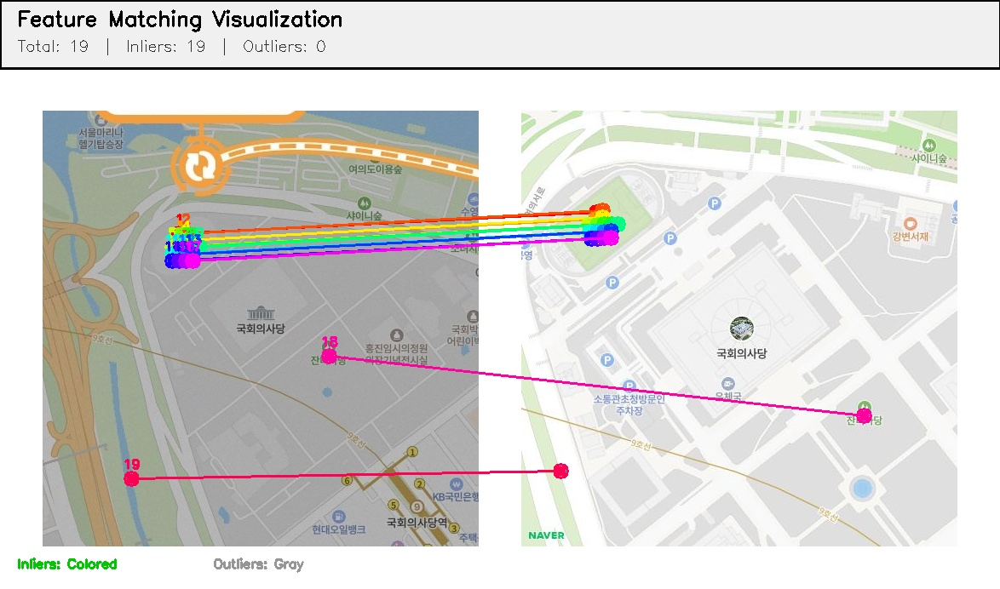
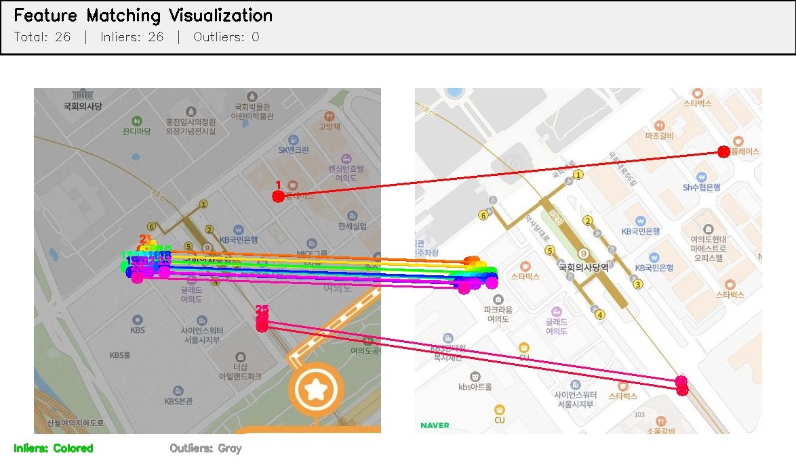
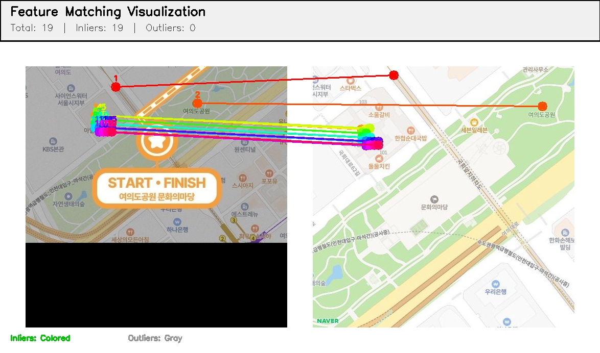
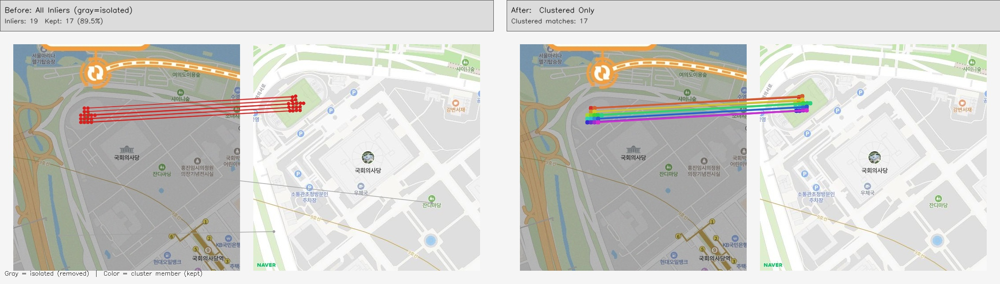
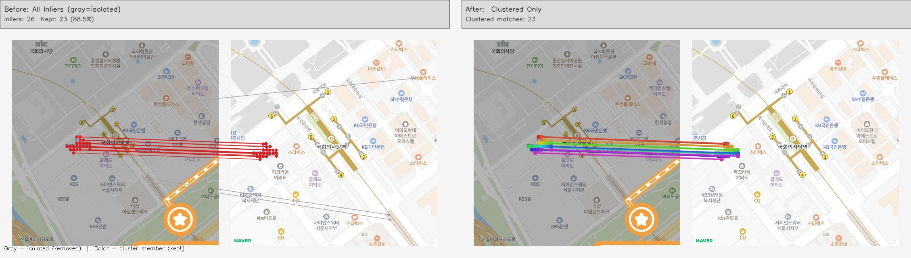
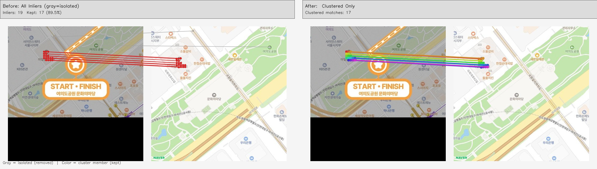
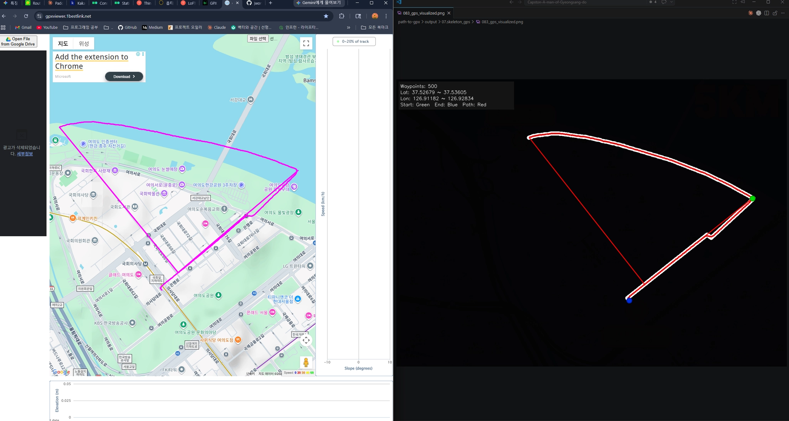
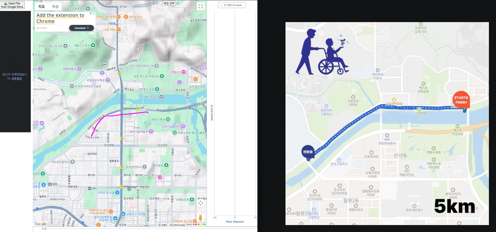

# 흐름 요약
1. OCR로 마라톤 이미지에서 텍스트 검출 → 주요 랜드마크 후보 추출
2. OCR 텍스트 → 위/경도 지오코딩 (카카오 API)
3. 위/경도로 Naver Maps 타일 이미지 생성
4. 마라톤 이미지와 타일에서 anchor 패치 생성
5. LoFTR로 anchor 패치 매칭 → 매칭 시각화 및 분석
6. TPS/아핀 정렬 모델 구축 → 마라톤 이미지와 지도 타일 정렬
7. TPS 정렬된 제어점으로 스켈레톤 → GPS 변환


## 1) OCR (이거 성능을 올려야함)
**마라톤 경로 이미지에서 텍스트를 검출하여 주요 랜드마크 후보를 추출하는 단계**

스크립트: [path-to-gpx/src/01_ocr.py](./src/01_ocr.py)

실행 예시
```
.\path-to-gpx\src\01_ocr.py --image . \path-to-gpx\data\images\110.jpg --output-dir .\path-to-gpx\output\ocr\ --lang korean --min-confidence 0.2
```

출력 위치
- [path-to-gpx/output/ocr](./output/01.ocr)

주요 산출물
- 이미지: 110_ocr_visualized.png
- JSON: 110_ocr_detections.json
- CSV: 110_ocr_detections.csv
- JSON: 110_ocr_rejected.json

#### 문제점
- OCR이 마라톤 이미지에서 텍스트를 제대로 검출하지 못함
- 무엇이 중요한 랜드마크 텍스트인지 판단이 어려움

#### 대체 방안:
- 하드코딩을 통해 주요 랜드마크 텍스트 후보를 미리 정의하여 검색
- 예시: '남산타워', '여의도한강공원', '빛가람대교' 등


## 2) Geocoding
**OCR로 검출된 텍스트를 기반으로 위/경도로 변환하는 단계 (카카오 로컬 API 사용)**

> 카카오 API를 사용한 이유는, OpenStreetMap Nominatim API가 한국 내 장소에 대한 지오코딩 정확도가 낮기 때문이다. 카카오 API는 한국 장소에 대한 지오코딩이 상대적으로 더 정확하므로, 마라톤 경로 이미지에서 검출된 텍스트를 효과적으로 위/경도로 변환할 수 있다.

스크립트: [path-to-gpx/src/02_geo_coding.py](./src/02_geo_coding.py)

실행 예시
```
python .\path-to-gpx\src\02_geo_coding.py --ocr-json .\path-to-gpx\output\01.ocr\110_ocr_detections.json --top-k 5
```

출력 위치
- [path-to-gpx/output/02.geo_coding](./output/02.geocoding/)

주요 산출물
- JSON: 110_geocode_candidates.json


## 3) Map Tiles 생성
**위/경도를 이용하여 Naver Maps Static API로 지도 타일 이미지 생성**

스크립트: [path-to-gpx/src/03_map_tiles.py](./src/03_map_tiles.py)

실행 예시
	python .\path-to-gpx\src\03_map_tiles.py --geocode-json .\path-to-gpx\output\02.geo_coding\110_geocode_candidates.json --zoom 14 --tile-size 700 --primary-keyword 여의도

출력 위치
- [path-to-gpx/output/03_map_tiles](./output/03.map_tiles)
- [path-to-gpx/output/03_map_tiles/tiles](./output/03.map_tiles/tiles)

주요 산출물
- 타일 이미지(핵심 1장, 선택 좌표가 중심): 110_z14_x13959_y6488.png
- 리포트 JSON: 110_map_tiles_report.json


## 4) anchor 패치 생성
**마라톤 이미지에서 OCR로 검출된 랜드마크 주변 패치와, Naver Maps 타일에서 대응 패치를 생성하여 매칭 준비**

스크립트: [path-to-gpx/src/04_anchor_patches.py](./src/04_anchor_patches.py)

실행 예시
```
python .\path-to-gpx\src\04_anchor_patches.py \
	--ocr-json .\path-to-gpx\output\01.ocr\110_ocr_detections.json \
	--geocode-json .\path-to-gpx\output\02.geo_coding\110_geocode_candidates.json \
	--zoom 14 \
	--patch-size 512 \
	--output-dir .\path-to-gpx\output\04.anchor_patches\
```
출력 위치
- [path-to-gpx/output/04.anchor_patches](./output/04.anchors/)

주요 산출물
- JSON: 110_anchor_patches.json
- 패치 이미지: 110_anchor_0_source.png, 110_anchor_0_reference.png, ...


## 5) LoFTR 매칭 및 시각화
**전통적인 컴퓨터비전 특징점 매칭 알고리즘인 SIFT 대신, 딥러닝 기반 LoFTR 매칭을 사용하여 anchor 패치 간의 대응점을 찾고, 다양한 시각화 방식으로 매칭 결과를 분석**

스크립트: [path-to-gpx/src/05_loftr_match.py](./src/05_loftr_match.py)

실행 예시
```
python .\path-to-gpx\src\05_loftr_match.py \
	--anchors-json .\path-to-gpx\output\04.anchor_patches\110_anchor_patches.json \
	--confidence 0.2 \
	--magsac-thr 3.0 \
	--output-dir .\path-to-gpx\output\loftr_matches\ \
	--save-visualizations
```
출력 위치
- [path-to-gpx/output/loftr_matches](./output/05.loftr/)
- [path-to-gpx/output/loftr_matches/visualizations](./output/05.loftr/083_match_visualizations)

주요 산출물
- JSON: 110_loftr_matches.json
- 시각화 이미지: 02_all_matches.jpg, 03_grid_view.jpg, 04_sequential_combined.jpg, anchor_110_matches_0001.jpg, ...

#### 083 image 매칭 시각화 예시




## 5-1) LoFTR Cluster 매칭 및 시각화
**anchor 패치 간의 LoFTR 매칭 결과를 클러스터링하여, 유사한 매칭 그룹을 시각적으로 구분하여 분석하는 단계**
**왜냐하면 떨어져있는 특징점은 이상하게 매칭이 된 경우가 많아서, 매칭 결과를 클러스터링해서 정확한 매칭그룹으로만 좌표변환을 계산하기 위해서이다.**

스크립트: [path-to-gpx/src/05_loftr_match_cluster.py](./src/05_loftr_match_cluster.py)

실행 예시
```
python .\path-to-gpx\src\05_loftr_match_cluster.py \
	--anchors-json .\path-to-gpx\output\04.anchor_patches\110_anchor_patches.json \
	--confidence 0.2 \
	--magsac-thr 3.0 \
	--output-dir .\path-to-gpx\output\loftr_cluster_matches\ \
	--no-vis
```
출력 위치
- [path-to-gpx/output/loftr_cluster_matches](./output/05.loftr_cluster/)

주요 산출물
- JSON: 110_loftr_cluster_matches.json
- 시각화 이미지: 02_clustered_matches.jpg, 03_cluster_grid_view.jpg

#### 083 image 매칭 시각화 예시




# 6) TPS / 아핀 정렬
**LoFTR 매칭 결과를 기반으로 TPS (Thin Plate Spline) 또는 아핀 변환 모델을 구축하여, 마라톤 이미지와 지도 타일 간의 정렬을 수행하는 단계**

스크립트: [path-to-gpx/src/06_tps_align.py](./src/06_tps_align.py)

실행 예시
```
python .\path-to-gpx\src\06_tps_align.py \
	--loftr-json .\path-to-gpx\output\05.loftr\110_loftr_matches.json \
	--smoothing 1e-4 \
	--min-dist-px 10.0
```
출력 위치
- [path-to-gpx/output/tps_align](./output/06.tps/)

주요 산출물
- JSON: 110_tps_alignment.json
- 시각화 이미지: 110_tps_alignment_visualization.jpg
- TPS 정렬된 이미지: 110_tps_warped.png
- TPS 정렬된 제어점: 110_tps_warped_points.json

# 7) 스켈레톤 → GPS 변환
**TPS 정렬된 제어점을 기반으로, 마라톤 이미지의 스켈레톤 경로를 실제 GPS 좌표로 변환하는 단계**

스크립트: [path-to-gpx/src/07_skeleton_to_gps.py](./src/07_skeleton_to_gps.py)

실행 예시
```
python .\path-to-gpx\src\07_skeleton_to_gps.py \
	--tps-json .\path-to-gpx\output\06.tps\110_tps_alignment.json \
	--skeleton-json .\path-to-gpx\output\01.ocr\110_ocr_detections.json \
	--output-dir .\path-to-gpx\output\07.skeleton_to_gps\
```

출력 위치
- [path-to-gpx/output/skeleton_to_gps](./output/07.skeleton_gps/)

주요 산출물
- JSON: 110_skeleton_gps.json
- GPX: 110_skeleton_gps.gpx
- 시각화 이미지: 110_skeleton_gps_visualization.jpg

# 출력 시각화 및 비교

#### 위/경도 오차 발생


#### gpx가 실제 마라톤 경로보다 짧게 나오는 문제 발생

